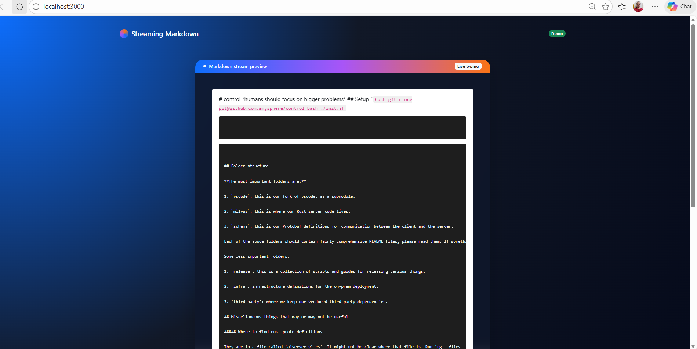

# 🚀 Streaming Markdown Parser

  

  <i>A real-time Markdown parser that styles content while it is being streamed.</i>

---

## 📝 Overview

This project implements a **streaming Markdown parser** that incrementally parses and renders Markdown text as it arrives in chunks, similar to how AI assistants like ChatGPT stream responses.

The parser applies styles **optimistically**, ensuring that Markdown elements are rendered immediately without re-rendering the entire DOM.

---

## ✨ Features

- 🔹 **Inline Code Parsing**  
  Supports single backticks  
  `print("hello world")`

- 🔹 **Code Block Parsing**  
  Supports triple backticks  
